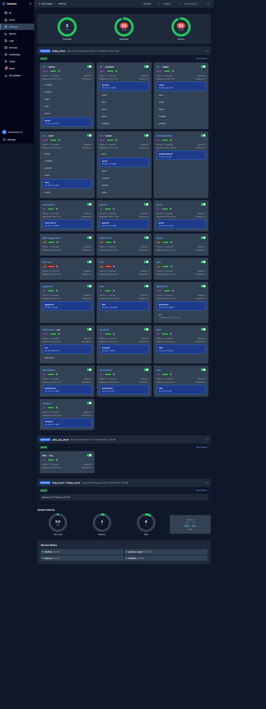

# HAProxy Dashboard: Stack Layout Redesign

> Research and recommendation for [issue #79](https://github.com/sarg3nt/gearbox/issues/79).
> Status: design proposal — no code changes yet.

## Table of contents

- [Problem statement](#problem-statement)
- [Current state](#current-state)
- [Best-practice research](#best-practice-research)
- [Layout options](#layout-options)
- [Recommendation](#recommendation)
- [Bottom-of-page widgets that aren't loading](#bottom-of-page-widgets-that-arent-loading)
- [Traffic-gear coupling (related, separate issue)](#traffic-gear-coupling-related-separate-issue)
- [Open questions](#open-questions)

## Problem statement

On the HAProxy gear dashboard (`/haproxy`), every docker-compose stack with
multiple HAProxy-exposed services produces one card per backend, and **every
card redundantly renders the entire stack's container topology** with a
different container highlighted as "the backend." A typical `arr` stack with
five containers and three exposed routes renders the same five-container
topology three times. The result is visual noise, wasted vertical space, and
the appearance that the dashboard is showing duplicate state when it is not.

The user has asked for: (1) deep investigation including best-practice
research, (2) concrete redesign options with the user's intuitions as
anchors — "one panel per stack with each container shown once" vs. "one card
per backend showing only its own container" — and (3) diagnosis of broken
widgets at the bottom of the page.

## Current state

### Live snapshot (light-hugger agent)



The Arr stack contributes five cards (`Arr → bazarr`, `→ prowlarr`,
`→ radarr`, `→ seerr`, `→ sonarr`); each card lists the same six
containers (`configarr / prowlarr / radarr / seerr / sonarr / bazarr`)
with one styled as the gateway. That's **30 container chips** drawn
just for one compose project. Qbittorrent shows the same pattern at
smaller scale (2 cards × 2 chips). Hardware backends (IPMIs, mjolnir,
thor, unifi) and standalone containerised services (vaultwarden, plex,
gitea, etc.) render correctly with a single container each.

### Routing and template

The `/haproxy` route renders [overview.templ:10](../../gearbox/internal/framework/templates/pages/overview.templ#L10),
which lazy-loads two HTMX partials per server:

| Region            | Endpoint                  | Renders                                          |
|-------------------|---------------------------|--------------------------------------------------|
| Top — stats grid  | `/htmx/{boxID}/stats`     | `StatsPartial` → `StatusSummarySection` + cards  |
| Bottom — metrics  | `/htmx/{boxID}/metrics`   | `MetricsPartial` → doughnuts + service-status    |

### How the repetition is produced

[overview.templ:745-751](../../gearbox/internal/framework/templates/pages/overview.templ#L745-L751) iterates
backends within each frontend's collapsible section:

```templ
for _, backend := range GetBackendsForFrontend(frontendStatus.Frontend.Name, stats.Backends, metadata) {
    @BackendCard(
        backend,
        GetBackendDisplayName(backend.Name),
        GetContainersForBackend(backend.Name, metadata),  // <-- full stack list
        ...
    )
}
```

`GetContainersForBackend` returns
[`backendMeta.Containers`](../../gearbox/internal/gears/haproxy/helpers.go) — which on the agent side is
populated with **every container in the compose stack** of the backend's
project. The shape is "backends own a containers list," not "stacks own a
containers list."

Each `BackendCard` then calls
[`@components.ContainerDiagram(containers, …)`](../../gearbox/internal/framework/templates/components/container_diagram.templ),
which renders the full topology with one container styled as the gateway/
backend (blue bordered) and the rest as supporting (grey). Because the
input list is the same for every backend in the stack, every card shows
the same diagram with a different element highlighted — the exact symptom
described in #79.

### Data-model implication

"Stack" is not a first-class type today. It is implicit — derived at agent
collection time from the docker-compose project of each backend's primary
container. Any redesign that hoists the stack to a parent grouping needs to
make that grouping explicit, either in the metadata model on the agent
(preferred) or as a render-time grouping derived from
`BackendGroupInfo.Group` on the dashboard.

## Best-practice research

I surveyed five categories of established tooling that solve "parent grouping
with many members." Full citations at the end of this document.

### Pattern A — Summary-then-detail (list + drill-in)

**Used by:** Portainer (Stacks list → Stack detail), Lens (Workloads table →
detail pane), Datadog APM (Service Map node → side panel).

```text
[Top-level list]                  [Detail page after click]
arr        5 running     ───►     Services: sonarr, radarr, gluetun
qbit       2 running              Containers: gluetun-1, sonarr-1, …
```

The parent row carries identity and a small status summary; the member
inventory lives one click away. The redundancy disappears because each
member appears exactly once in the entire UI.

### Pattern B — Grouped sections with members as rows

**Used by:** HAProxy's own stats page, every popular Prometheus-HAProxy
Grafana dashboard, k9s.

```text
== backend: sonarr_backend ==
| server        | status | sessions | response |
| sonarr-srv-1  | UP     |    12    |   42ms   |
== backend: radarr_backend ==
| radarr-srv-1  | UP     |     7    |   38ms   |
```

One header per parent, a homogeneous table of children beneath. Members
are uniform and visible at once. Cheap to scan; minimal vertical waste.

### Pattern C — Explicit hierarchical tree / graph

**Used by:** ArgoCD's resource tree, Datadog's Service Map.

```text
App "arr" ─┬─ gluetun ─┬─ sonarr  ── route: sonarr.sarg3.net
           │           ├─ radarr  ── route: radarr.sarg3.net
           │           └─ prowlarr── route: prowlarr.sarg3.net
           └─ recyclarr (cron, no route)
```

The relationship *is* the navigation. Each node appears exactly once with
collapse/expand to manage density. Best when the relationships themselves
carry information (VPN gateway sharing, dependency edges).

### NN/g and Refactoring UI guidance

- [Progressive Disclosure (NN/g)](https://www.nngroup.com/articles/progressive-disclosure/) — high-level summary up front, details on click, configuration on deliberate intent. The primary list must stay short or you've merely relocated complexity.
- [Cards (NN/g)](https://www.nngroup.com/articles/cards-component/) — a card should be a *linked entry point* to detail, not a container that re-inlines that detail.
- [Refactoring UI](https://medium.com/design-bootcamp/top-20-key-points-from-refactoring-ui-by-adam-wathan-steve-schoger-d81042ac9802) — tables beat cards for scanning homogeneous rows; cards earn their cost when items are heterogeneous.

The current Gearbox dashboard violates all three: cards are not linked
entry points (the container diagram is inlined), the list is not short
(every backend gets a top-level card), and the items are not heterogeneous
(siblings in a stack share most of their visible content).

## Layout options

Three concrete options, ordered roughly from most-conservative to
most-aggressive refactor. The status badges, monitoring toggle, response-
time / sessions / queue stats remain in all three — only the grouping and
the container-topology block change.

### Option 1 — Stack as a section header, backends as compact cards (Pattern B)

The "stack" becomes a `CollapsibleSectionWithStats` containing one
**compact** backend card per route. The container topology renders **once**,
inside the stack header. Each compact card shows only what's
backend-specific: hostname, status badge, response time, sessions,
monitoring toggle.

```text
┌─ FRONTEND: https-in ─────────────────────────────────────────────────┐
│                                                                      │
│  ┌─ STACK: arr  ── 3 backends · 5 containers · 100% healthy ──────┐  │
│  │                                                                │  │
│  │  ┌─ Topology ─────────────────────────────────────────────────┐│  │
│  │  │  ┌─ gluetun (10.40.0.22) ─────────────────────────────────┐││  │
│  │  │  │ ↳ sonarr  · radarr · prowlarr · recyclarr (no route)   │││  │
│  │  │  └────────────────────────────────────────────────────────┘││  │
│  │  └────────────────────────────────────────────────────────────┘│  │
│  │                                                                │  │
│  │  ┌─ sonarr.sarg3.net ─┐ ┌─ radarr.sarg3.net ─┐ ┌─ prowlarr ─┐  │  │
│  │  │ UP · 12 sess · 42ms│ │ UP · 7 sess · 38ms │ │ UP · 1·15ms│  │  │
│  │  │ ●─── monitoring ───│ │ ●─── monitoring ───│ │ ●── mon ───│  │  │
│  │  └────────────────────┘ └────────────────────┘ └────────────┘  │  │
│  └────────────────────────────────────────────────────────────────┘  │
│                                                                      │
│  ┌─ STACK: qbittorrent  ── 1 backend · 2 containers · 100% ──────┐   │
│  │  (topology + single compact card, same shape)                 │   │
│  └───────────────────────────────────────────────────────────────┘   │
│                                                                      │
│  ┌─ Standalone services ── 4 backends ───────────────────────────┐   │
│  │  ┌─ vaultwarden ─┐ ┌─ gitea ─┐ ┌─ wikijs ─┐ ┌─ ntfy ─┐         │   │
│  │  │ UP · 3 · 22ms │ │ UP·…    │ │ UP·…     │ │ UP·…   │         │   │
│  │  └───────────────┘ └─────────┘ └──────────┘ └────────┘         │   │
│  └───────────────────────────────────────────────────────────────┘   │
└──────────────────────────────────────────────────────────────────────┘
```

**Pros:** matches established practice (Pattern B); container topology
shown exactly once; existing health/disable/filter logic ports cleanly
because compact cards retain the same data attributes. Single-backend
stacks (vaultwarden, gitea, etc.) don't get an extra wrapper — they fall
into a single "Standalone services" group.

**Cons:** introduces a new "stack" grouping concept that needs a stable
identifier. The agent must emit `stack_name` (compose project) per backend
or the dashboard must derive it from `BackendGroupInfo.Group` (already
parseable from the backend name today).

**Effort:** medium. Mostly a `StatsPartial` reshape + a new
`CompactBackendCard` component + extracting `ContainerDiagram` to a
header-of-stack location. No agent changes if we derive stack from
backend name; agent change preferred for robustness.

### Option 2 — One card per backend, **single** container shown (user's "alternative")

Keep the current card grid; change `GetContainersForBackend` (or the agent
metadata) so each backend's container list contains **only** the container
that actually serves that backend. Show the full stack topology only on
the backend-detail page (`/box/{id}/backend/{name}`).

```text
┌─ sonarr.sarg3.net ────────┐  ┌─ radarr.sarg3.net ────────┐
│ UP · 12 sess · 42ms       │  │ UP · 7 sess · 38ms        │
│ ┌─ sonarr (10.40.0.22) ─┐ │  │ ┌─ radarr (10.40.0.22) ─┐ │
│ │ via gluetun (VPN)     │ │  │ │ via gluetun (VPN)     │ │
│ └───────────────────────┘ │  │ └───────────────────────┘ │
└───────────────────────────┘  └───────────────────────────┘
```

**Pros:** smallest refactor — no new grouping layer; existing filter and
toggle UX unchanged; eliminates the duplication immediately.

**Cons:** loses the visible stack relationship at the dashboard level (you
no longer see at a glance that sonarr / radarr / prowlarr share a gateway).
The "via gluetun (VPN)" annotation is a partial mitigation. Detail page
becomes the only place the full topology lives.

**Effort:** small. Mostly a one-function change to filter the container
list to the single backend container, plus a small `via <gateway>` label
when `NetworkMode` starts with `service:`.

### Option 3 — Tree / graph at the stack level (Pattern C)

Replace the card grid entirely with an ArgoCD-style horizontal resource
tree per frontend. Stacks are the first-level nodes, backends hang off the
gateway container, and standalone backends are leaves directly under the
frontend.

```text
https-in ─┬─ arr ─── gluetun ─┬─ sonarr   ── route ✓  12 sess  42ms
          │                   ├─ radarr   ── route ✓   7 sess  38ms
          │                   └─ prowlarr ── route ✓   1 sess  15ms
          ├─ qbittorrent ─ gluetun-qb ─ qbittorrent ── route ✓  …
          └─ standalone ─┬─ vaultwarden ── route ✓  3 sess  22ms
                         ├─ gitea
                         └─ wikijs
```

**Pros:** most expressive — visually encodes the VPN-gateway
relationship and dependency edges that are currently only available in a
tooltip; each entity appears exactly once. Closest match to the user's
"see each container with a net stack" intuition.

**Cons:** biggest UI rewrite; harder to do well with HTMX + morphdom
refresh (the SSE-driven update logic currently targets `data-backend-name`
attributes on cards); narrower viewports get crowded. Filtering is harder
to express on a tree than on a grid.

**Effort:** large. New component, new SSE update strategy, real design
work on responsive behaviour.

## Recommendation

> [!IMPORTANT]
> **Adopt Option 1** (stack-as-section + compact backend cards).

Reasons:

- Matches the dominant industry pattern for HAProxy-shaped data
  (frontend / backend / server hierarchy). HAProxy's own stats page,
  every popular Grafana HAProxy dashboard, and k9s all use this shape.
- Solves the stated problem directly: container topology appears exactly
  once per stack, not once per backend.
- Preserves what already works — the SSE refresh path, the disable
  toggle, the global filters, the cert-warning slot above — because the
  compact cards keep the same `data-backend-name` / `data-health-percent`
  attributes the existing JS reads.
- Single-backend stacks degrade gracefully into a "Standalone services"
  group, so the dashboard doesn't grow vertical chrome for trivial cases.
- Leaves the door open to introduce a tree view later (Option 3) as a
  user-toggleable "view mode" without ripping out the grid people will
  have learned.

Option 2 is a viable fallback if scope must shrink — it eliminates the
duplication with minimal code change but loses the visible stack
relationship. Option 3 is worth revisiting once Option 1 has shipped and
we have a sense of how often users actually need to see the full topology
at a glance.

### Suggested implementation outline

1. **Agent side** — extend `BackendMetadata` (or add `StackMetadata`) so
   each backend carries a `stack_name` (the compose project) and the
   stack's container list lives on the stack, not on each backend. Keep
   `Containers` on `BackendMetadata` populated with only the single
   serving container for backwards compatibility during rollout.
2. **Dashboard helpers** — add `GroupBackendsByStack(...)` next to
   `GetBackendsForFrontend(...)` in `internal/gears/haproxy/helpers.go`.
   Single-backend stacks group under a synthetic "standalone" key.
3. **Template** — replace the inner `backend-card-grid` loop in
   `StatsPartial` with a per-stack `<section>` containing (a) a topology
   row using the existing `@components.ContainerDiagram`, (b) a compact
   card grid using a new `@CompactBackendCard`.
4. **Compact card** — keep the same outer `<a>` linking to the backend
   detail page, the same data attributes for filter/SSE-refresh, and the
   same monitoring toggle. Drop the `ContainerDiagram` call and the
   info-icon tooltip block (move tooltip content into the stack header).
5. **CSS** — compact cards should fit 3-up on `lg`, 4-up on `xl`. Topology
   row spans the full stack section width.
6. **Backwards-compat** — orphaned backends keep falling into the existing
   "Other Backends" section unchanged.

## Bottom-of-page widgets that aren't loading

**Verified live against `localhost:3000/haproxy` (light-hugger agent).**
The bottom of the page consists of two regions, both rendered by
[`MetricsPartial`](../../gearbox/internal/framework/templates/pages/overview.templ#L1214-L1223),
which the page lazy-loads via:

```html
<div hx-get="/htmx/{boxID}/metrics" hx-trigger="load" hx-swap="innerHTML">
    @components.LoadingSpinner()
</div>
```

Current state in dev:

| Region                            | Renders in dev? | Notes                                                                                |
|-----------------------------------|-----------------|--------------------------------------------------------------------------------------|
| System Metrics (CPU / Mem / Disk / Network) | Yes      | Inline SVG gauges (no Chart.js canvas) — values populated, gauges drawn correctly.   |
| Service Status list               | Yes             | 4 rows: `haproxy`, `gearbox-agent`, `nftables`, `fail2ban`, all green / `(active)`.  |

Network panel: every `/htmx/light-hugger/{stats,metrics}` poll returned
`200` over a 30+ request sample; no failed XHR. The only console errors
were CSP-blocked sourcemap fetches for the CDN-hosted Chart.js / hammer.js
/ tabulator scripts — dev-only noise (the `.map` requests violate the
`connect-src 'self' ws: wss:` directive), unrelated to widget rendering.

> [!IMPORTANT]
> **The "widgets aren't loading" symptom from #79 does not reproduce on
> current `main` in dev.** It is most likely already fixed by one of the
> recent rewrites of the chart / metrics rendering path
> (`9bf2004 fix: rewrite charts using templ script blocks and global JS namespace`,
> `4fa5ee1 refactor: remove metrics chart widgets and their registration`,
> `2f38336 Remove widget palette management and sortable loader scripts`).
> Worth confirming on prod once `gearbox.sarg3.net` is redeployed; if it
> still misbehaves there, the fix hasn't shipped or there's a
> prod-specific config drift.

### Smaller follow-ups surfaced during live inspection

These are not the headline issue but came out of the same session:

- **Service Status list is hardcoded** to a fixed 4-service list in
  [`gearbox-agent/internal/gears/metrics/plugin.go:110-118`](../../gearbox-agent/internal/gears/metrics/plugin.go#L110-L118).
  Other gears can contribute via the `ServiceGear.MonitoredServices()`
  interface, but only the metrics gear declares any today. Consider
  letting more gears (or a per-box config) extend this list rather than
  shipping a fixed set — a `light-hugger` box and a TrueNAS box should not
  show the same four services.
- **CDN sourcemap CSP errors** in dev. The `connect-src` directive blocks
  the `.js.map` fetches that browsers do on devtools-open. Easy fix:
  either self-host the libraries (already on the roadmap based on the
  console warning `cdn.tailwindcss.com should not be used in production`),
  or add `https://cdn.jsdelivr.net https://unpkg.com` to `connect-src` in
  dev builds only. Not worth a separate issue unless it becomes louder.

## Traffic-gear coupling (related, separate issue)

Issue #79 asks a second, scoped question that the user wants tracked
separately: should the Traffic gear be made box-agnostic, or remain an
HAProxy-only feature?

### Findings

The agent-side traffic gear
([gearbox-agent/internal/gears/traffic/plugin.go](../../gearbox-agent/internal/gears/traffic/plugin.go))
is **structurally HAProxy-coupled**:

- Its data sources are HAProxy stick tables (per-IP request/byte counters)
  and HAProxy stats CSV (per-backend traffic, response codes, latency).
- `Initialize` only creates the stats client when
  `HAProxyStatsSocket` or `HAProxyStatsURL` is configured.
- `Probe` already returns `not_installed` on boxes without HAProxy, so on
  non-HAProxy hosts the gear self-disables — the *user-facing* badge of
  the current design is "this gear is only available where HAProxy is."

### Options for the follow-up issue

1. **Rename for honesty.** Call the gear `haproxy_traffic` and leave the
   feature set as-is. The "agnostic" claim is implicit in the probe
   already, and any new traffic source deserves its own gear with its own
   schema.
2. **Refactor to a multi-source traffic gear.** Add adapters for generic
   data sources (Linux `ss`, `conntrack`, `/proc/net/tcp`, eBPF, NetFlow)
   behind a `TrafficSource` interface; HAProxy becomes one source among
   many. Each source emits a different subset of the existing schema
   (e.g. `ss` produces connection counts but no per-backend latency).
3. **Split.** Keep `haproxy_traffic` HAProxy-only, and add a separate
   `connections` gear for the generic Linux case. Boxes can enable
   either, both, or neither.

A new GitHub issue will be filed alongside this document so the question
gets a proper backlog slot — see the follow-up link at the end of #79.

## Open questions

- **`stack_name` source of truth.** Derive on the dashboard from
  `BackendGroupInfo.Group`, or push from the agent as a first-class field
  on `BackendMetadata`? Agent-side is more robust to backend-naming
  changes; dashboard-side ships faster.
- **What counts as a "stack"?** Compose project? Compose project + custom
  label? A backend that names a non-containerized service (hardware)
  should not be forced into a synthetic stack.
- **Topology placement.** Inside the stack header (proposed) or in a
  collapsible sub-section that's collapsed by default (less vertical
  weight on stacks with many routes)?
- **Compact-card density.** 3-up on `lg` matches the current grid; should
  stacks with one backend collapse the section chrome entirely and render
  as a bare card?

## References

- [HAProxy Stats Page guide — HAProxy Technologies](https://www.haproxy.com/blog/exploring-the-haproxy-stats-page)
- [Grafana — HAProxy (Frontend/Backend/Servers) dashboard #9773](https://grafana.com/grafana/dashboards/9773-haproxy-proxy-reverseproxy/)
- [Portainer — Inspect or edit a stack](https://docs.portainer.io/user/docker/stacks/edit)
- [Lens Kubernetes IDE](https://k8slens.dev/) · [A visual guide to Lens (opensource.com)](https://opensource.com/article/20/7/kubernetes-lens)
- [ArgoCD resource tree view](https://oneuptime.com/blog/post/2026-02-26-argocd-resource-tree-view/view) · [live demo](https://cd.apps.argoproj.io/applications/argo-cd)
- [Datadog Service Map docs](https://docs.datadoghq.com/tracing/services/services_map/) · [Datadog blog: Introducing the Service Map](https://www.datadoghq.com/blog/service-map/)
- [NN/g — Progressive Disclosure](https://www.nngroup.com/articles/progressive-disclosure/)
- [NN/g — Cards: UI-Component Definition](https://www.nngroup.com/articles/cards-component/)
- [Refactoring UI — key points](https://medium.com/design-bootcamp/top-20-key-points-from-refactoring-ui-by-adam-wathan-steve-schoger-d81042ac9802)
